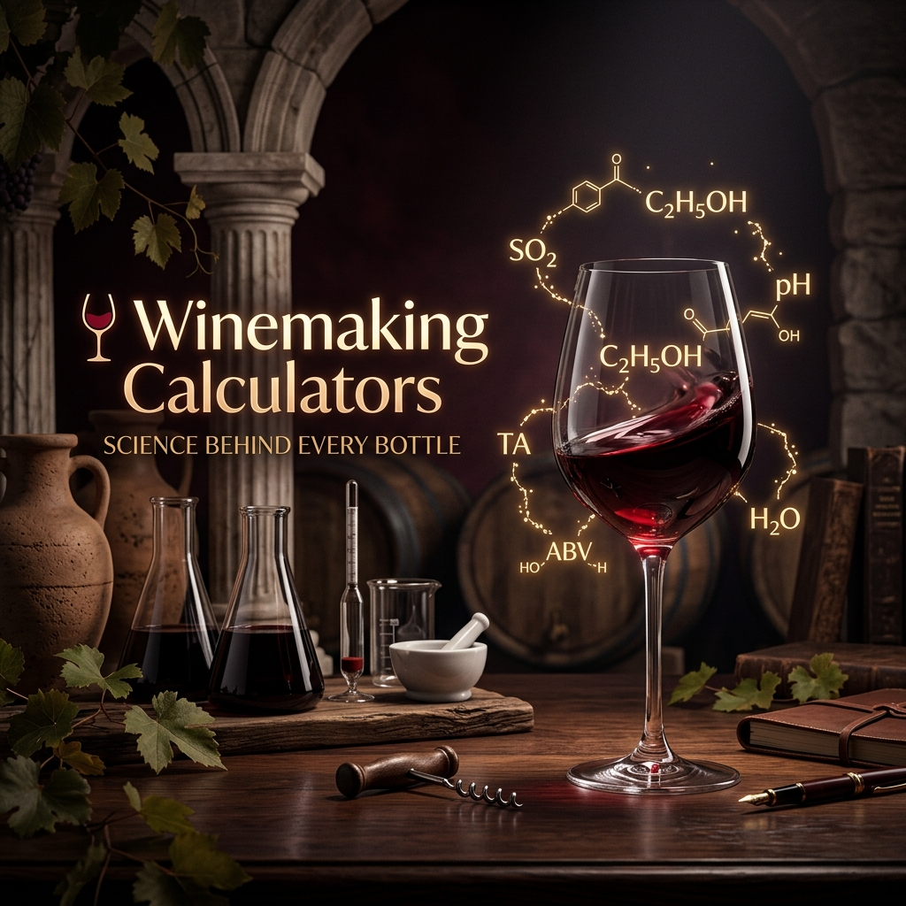
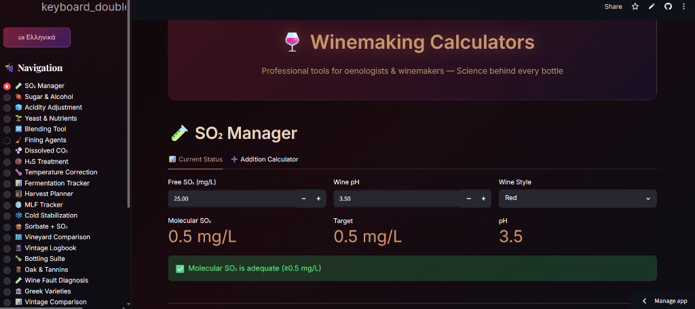

<p align="center">
  
</p>

<h1 align="center">🍷 Winemaking Calculators</h1>

<p align="center">
  <strong>Professional tools for oenologists & winemakers — Science behind every bottle.</strong><br>
  <em>8 calculators. Zero fluff. 100% open source.</em>
</p>

<p align="center">
  
  <a href="https://winemaking-calculators.streamlit.app/"></a>
  
  
</p>

<p align="center">
  
</p>

---

## 🧪 Why this exists

Winemakers and oenologists deal with the same calculations daily — SO₂ additions, chaptalization, acidification, yeast rehydration — often done by hand, on a notepad, at 3am in a cellar.

This repository gives you **clean, documented Python code** for every core winemaking formula, wrapped in a **beautiful web UI** you can run on any device — including your phone in the vineyard.

---

## 🛠️ Available Calculators

| # | Calculator | What it does |
|---|-----------|-------------|
| 1 | 🧪 **SO₂ Manager** | Molecular SO₂, free SO₂ needed, additions in g for K₂S₂O₅ / liquid SO₂ |
| 2 | 🍬 **Sugar & Alcohol** | Brix → Potential Alcohol, SG → Brix, Chaptalization amounts |
| 3 | 🧊 **Acidity Adjustment** | Tartaric acid addition (acidification), CaCO₃ deacidification |
| 4 | 🌱 **Yeast & Nutrients** | GO-FERM rehydration, DAP/Fermaid-O YAN additions |
| 5 | 🔀 **Blending Tool** | Blend result calculator + Pearson's Square for target blends |
| 6 | 🧹 **Fining Agents** | Bentonite, egg white, gelatine, isinglass, carbon additions |
| 7 | 🫧 **Dissolved CO₂** | Henry's Law CO₂ estimates by temperature and wine style |
| 8 | 🟤 **H₂S Treatment** | Copper sulfate (CuSO₄·5H₂O) addition for rotten egg removal |
| 9 | 🧫 **MLF Tracker** | Malolactic Fermentation progress and pH/TA impact |
| 10 | ❄️ **Cold Stabilization** | Würdig formula stabilization temp, duration, seeding, conductivity test |
| 11 | 🍯 **Sorbate + SO₂** | Sweet wine chemical stabilization with EU legal limits check |
| 12 | 🗺️ **Vineyard Comparison** | Score and compare 2-5 lots/vineyards using radar charts |
| 13 | 📓 **Vintage Logbook** | Cellar logbook diary with filtering and CSV export |
| 14 | 🍾 **Bottling Suite** | Bottle/case needs with transfer losses and thermal expansion check |
| 15 | 🪵 **Oak & Tannins** | Oak alternative dosage (chips, cubes, staves) with extraction times |
| 16 | 🧪 **Wine Fault Diagnosis** | Rule-based diagnosis based on sensory analysis symptoms |
| 17 | 🏛 **Greek Varieties** | Analytical benchmark against optimal grape ranges (Xinomavro, Assyrtiko, etc.) |

---

## 🚀 Quick Start

### Option 1: Run the Web App
```bash
git clone https://github.com/karidasd/winemaking-calculators
cd winemaking-calculators
pip install -r requirements.txt
streamlit run app.py
```
Open your browser at `http://localhost:8501`

### Option 2: Use as Python Library
```python
from calculators import molecular_so2, so2_needed_for_molecular, so2_addition_grams

# What's my current molecular SO₂?
mol = molecular_so2(free_so2=30, ph=3.6)
print(f"Molecular SO₂: {mol} mg/L")  # → 0.68 mg/L

# How much SO₂ do I need to add?
needed = so2_needed_for_molecular(target_molecular=0.8, ph=3.6, current_free_so2=30)
print(f"Need to add: {needed} mg/L free SO₂")

# How many grams of K₂S₂O₅ for a 5000L tank?
amounts = so2_addition_grams(needed, volume_liters=5000)
print(f"Add: {amounts['potassium_metabisulfite_g']}g of K₂S₂O₅")
```

---

## 📐 Formula Reference

### SO₂
```
Molecular SO₂ = Free SO₂ / (1 + 10^(pH - 1.81))
```

### Potential Alcohol
```
PA (% ABV) = (Brix × 0.5765) - 0.65
```

### Chaptalization
```
Sugar to add (g) = ΔBrix × 17 × Volume (L)
```

### Pearson's Square
```
Parts A = |Value_B - Target|
Parts B = |Value_A - Target|
Volume A = (Parts A / Total Parts) × Total Volume
```

---

## 📚 References

- Boulton, R. et al. *Principles and Practices of Winemaking* (2013)
- Zoecklein, B. et al. *Wine Analysis and Production* (1995)
- OIV International Standards — [oiv.int](https://www.oiv.int)
- Peynaud, E. *Knowing and Making Wine* (1984)

---

## ⚠️ Disclaimer

These calculators are for educational and reference purposes. Always verify critical additions with a **certified oenologist**. Legal limits for additives vary by country and wine style.

---

<p align="center">Built with ❤️ by <a href="https://github.com/karidasd">DarkAIs</a> | MIT License</p>
